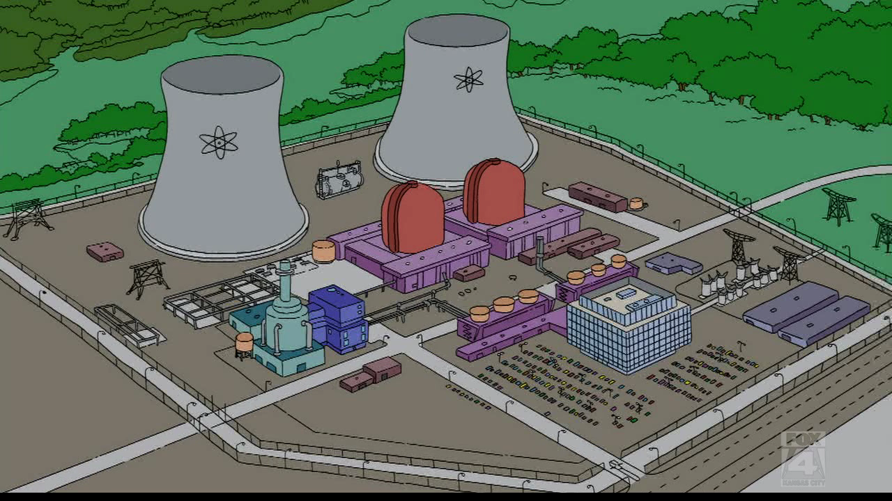
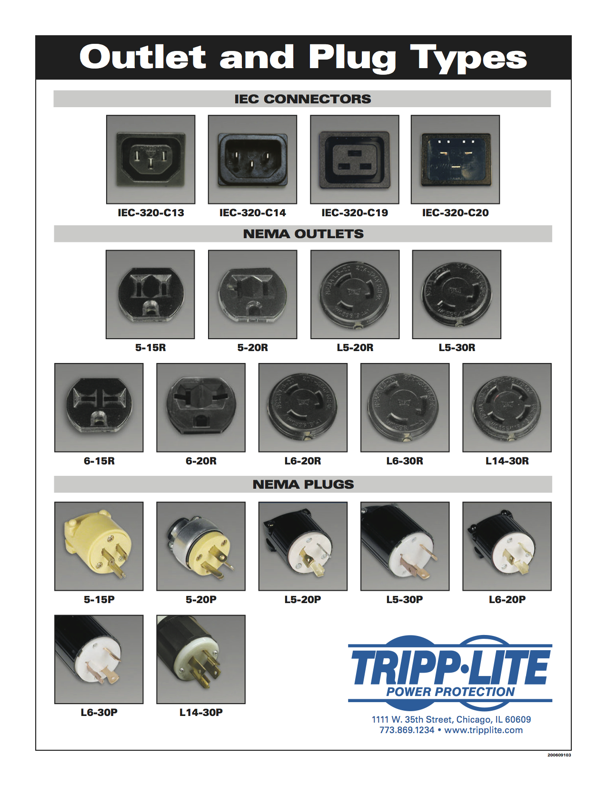

!SLIDE

# Power #

!SLIDE center

!SLIDE

# Not Really #

!SLIDE 

# Big Stuff #

!SLIDE 

## UPS ##

!SLIDE

## Generator ##

!SLIDE 

# Smaller Physical Suffs #

!SLIDE 

##  Plug Types ##

!SLIDE bullets incremental

## PDU and CDUs ##

* Essentially power strips
* May be smart aka IP connected
* May be metered

!SLIDE

## Breakers ##

aka The Panel

## Whips/Runs ##

These are the actual plugs that run out to the racks

